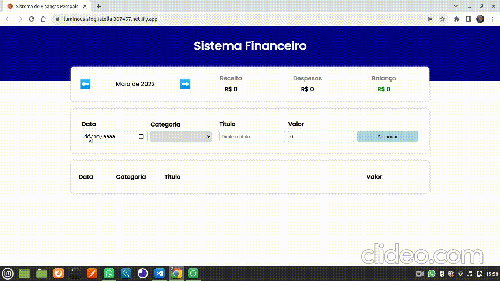
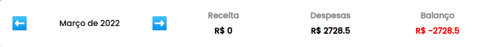
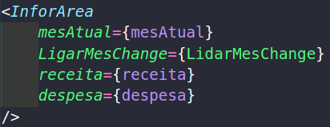
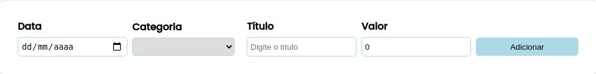
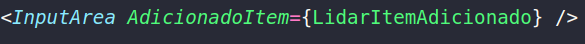
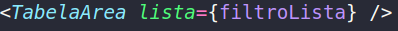

## Sistema de Finanças Pessoais

### Sobre 

O sistema de finanças pessoais criado através do react, tem como principal
objetivo aprimorar meus conhecimentos dentro da lógica de programação, além
de manipular datas e realizando formatação em diversos casos.

Ela foi projetada pensando em três áreas: 
- **Área de informação:** onde vai ficar as datas correspondente a solicitação do usuário, devolvendo suas despesas e receita durante aquele mês.
- **Área de Envio**: Existindo quatro campos criados, onde o usuário vai enviar a data correspondente daquele mês, seguido por categoria, título e valor.
- **Área da Tabela**: O sistema vai devolver com os dados incorporados dentro do array, sabendo que esses dados podem ser enviados, mas não são armazenados permanentemente no sistema.

### Projeto sendo utilizado



### Escopo do projeto

#### InforArea

Componente responsável mostrar sua data atual, receita e despesa referente aquele determinado mês. Lembrando do balanço sendo mostrado.




- [x] components/InforArea/inforArea.tsx
- [x] components/InforArea/style.ts

#### InputArea

Componente responsável pela inserção de elementos dentro da tabela, para que todos os dados da tabela possa fazer sentido ao usuário.




- [x] components/InputArea/InputArea.tsx
- [x] components/InputArea/style.ts 

#### TabelaArea

Demonstração dos dados anteriormente cadastrado, quaisquer dados inseridos estará sendo apresentado nessa tabela. Lembrando: **se estiver buscando no mês incorreto, não estará sendo notado**.




- [x] components/TabelaArea/TabelaArea.tsx
- [x] components/TabelaArea/style.ts 

### O que foi utilizado no projeto?

- [x] React
- [x] TypeScript
- [x] React-Router-DOM
- [x] Styled-Components

### Como executar o projeto?

Como qualquer projeto React ele é introduzido através do pacote gerenciador que armazena os módulos utilizados na lib. Sendo gerado através de um arquivo package.json

**Executado o projeto**

```bash
# Clone este repositório
$ git clone https://github.com/MateusMaciel340/expense-tracker.git

# Acesse a pasta do projeto no terminal/cmd - React
$ cd expense-tracker/

# Acessando os arquivos - (VSCode)
$ code .

# Instalação das dependências
npm install
```

### Desenvolvedor


Mateus Sousa - <b>Desenvolvedor</b>


### Licença

Este projeto está sobre a licença do [MIT](https://github.com/facebook/react/blob/main/LICENSE)